# Day 2

1. Make an EC2 with EBS 20GB then increase the size of the EBS to 40GB.

<p align="center">
  <strong>EC2 Creation</strong>
  <br>
  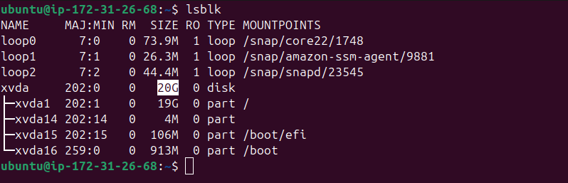
</p>

<p align="center">
  <strong>Increase EBS size from AWS management console</strong>
  <br>
  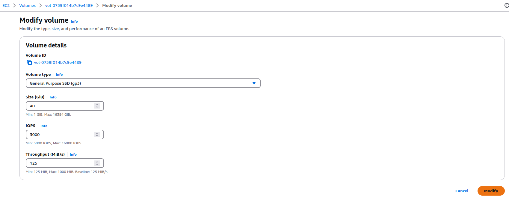
</p>

<p align="center">
  <strong>Validate EBS size after modification</strong>
  <br>
  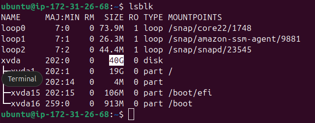
</p>

<p align="center">
  <strong>Use the unallocated new space to increase the size of partition one</strong>
  <br>
  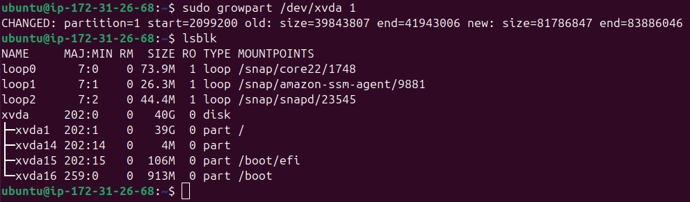
</p>

---

2. Make an AMI with Docker installed and run another EC2 from this AMI.
- Install Docker:
    ```bash
    sudo apt update
    sudo apt install -y ca-certificates curl gnupg lsb-release
    sudo mkdir -p /etc/apt/keyrings
    curl -fsSL https://download.docker.com/linux/ubuntu/gpg | \
      sudo gpg --dearmor -o /etc/apt/keyrings/docker.gpg
    echo \
      "deb [arch=$(dpkg --print-architecture) signed-by=/etc/apt/keyrings/docker.gpg] \
      https://download.docker.com/linux/ubuntu $(lsb_release -cs) stable" | \
      sudo tee /etc/apt/sources.list.d/docker.list > /dev/null
    sudo apt update
    sudo apt install -y docker-ce docker-ce-cli containerd.io docker-buildx-plugin docker-compose-plugin
    sudo usermod -aG docker $USER
    ```

<p align="center">
  <strong>Validate Docker Installation</strong>
  <br>
  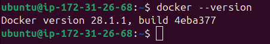
</p>

<p align="center">
  <strong>Create an AMI from console</strong>
  <br>
  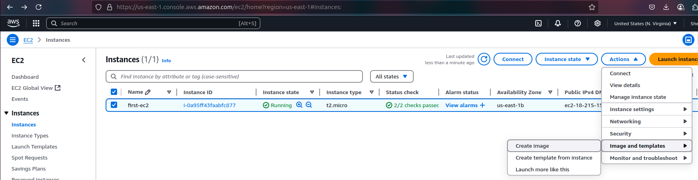
</p>

<p align="center">
  <strong>Wait AMI to be available and "launch instance from AMI"</strong>
  <br>
  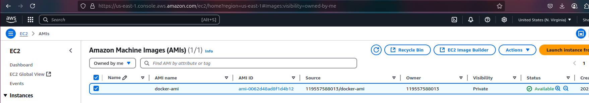
</p>

---

3. Make EFS and mount those two servers. Prove that a change in one server is the same in the second server.

<p align="center">
  <strong>Create a Security Group for the EFS and add an Inbound rule of type NFS with a source from the EC2 Security Groups</strong>
  <br>
  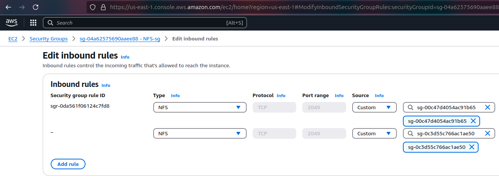
</p>

<p align="center">
  <strong>Create an EFS, add a name, and customize: Disable backups, Transition into IA, and encryption of data at rest</strong>
  <br>
  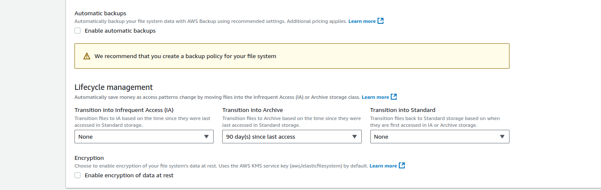
</p>

<p align="center">
  <strong>Next, leave only 2 AZs, and add the Security Group we created for the EFS</strong>
  <br>
  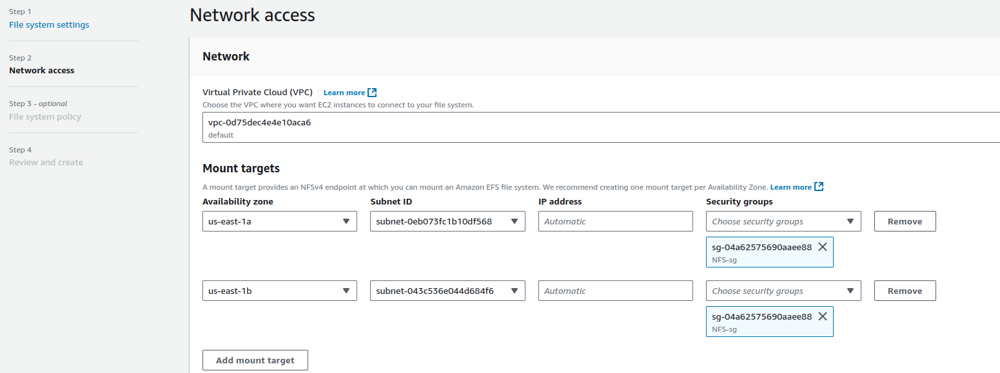
</p>

- Wait until it's available, press on "Attach", and copy the mount via IP command of the same AZ your EC2 instances are in.

- SSH into each EC2, then:
    - Execute `sudo apt update && sudo apt install -y nfs-common` to install the required NFS utilities.
    - Create a mount directory: `sudo mkdir -p /mnt/efs`
    - Execute the copied command.
    
<p align="center">
  <strong>Validate EFS Mount</strong>
  <br>
  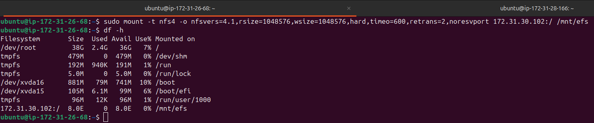
</p>

---

4. Create a snapshot from EBS and make a new volume from it in another AZ.

<p align="center">
  <strong>From an existing Volume, create a new snapshot</strong>
  <br>
  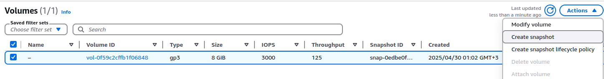
</p>

<p align="center">
  <strong>Wait for snapshot to complete, then create a new volume</strong>
  <br>
  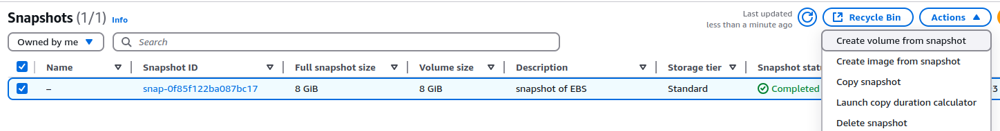
</p>

<p align="center">
  <strong> Choose another AZ</strong>
  <br>
  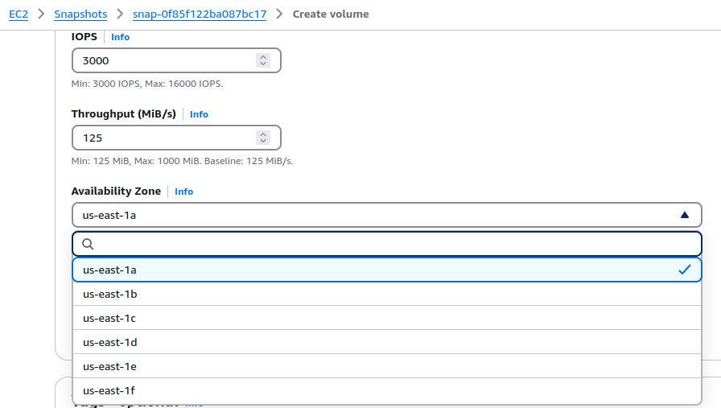
</p>

---
