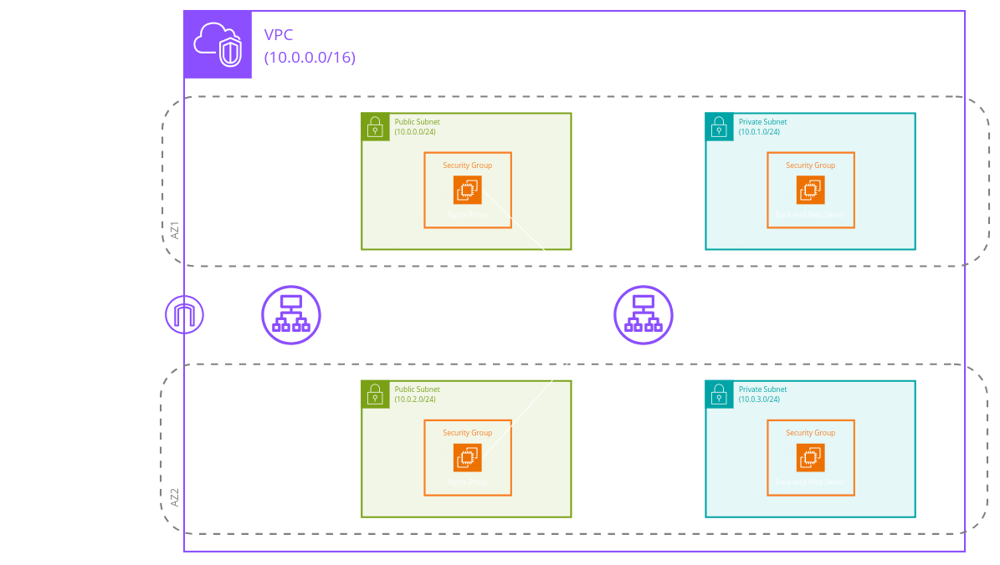
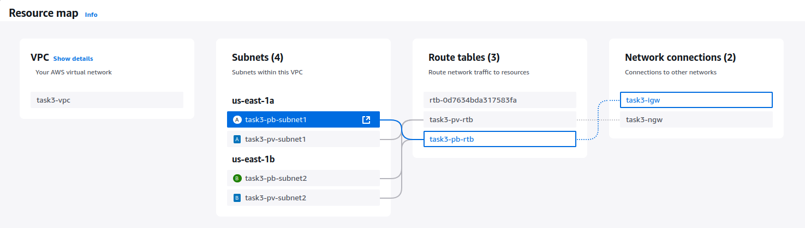
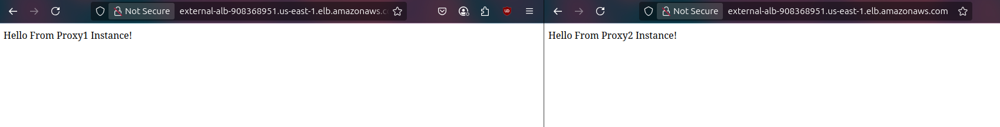
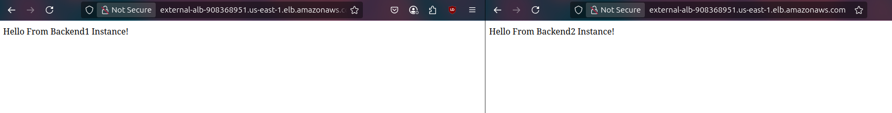
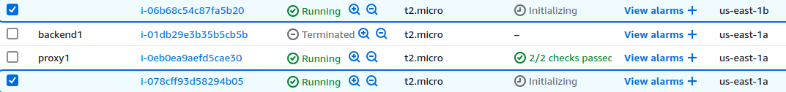
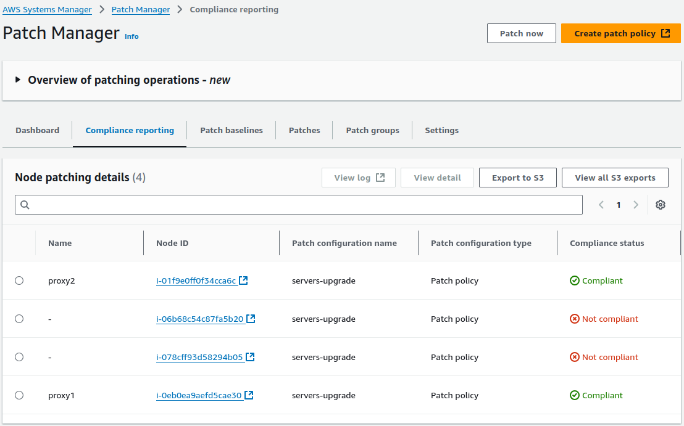
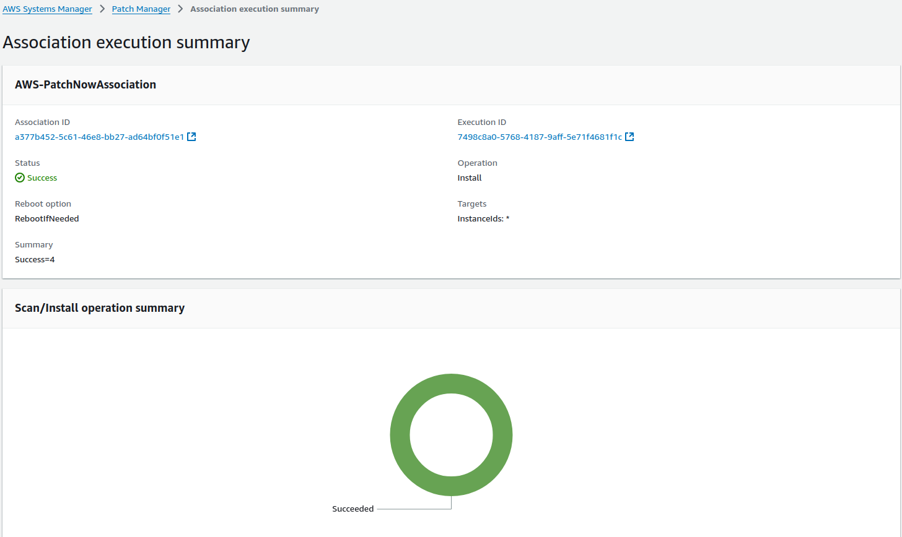
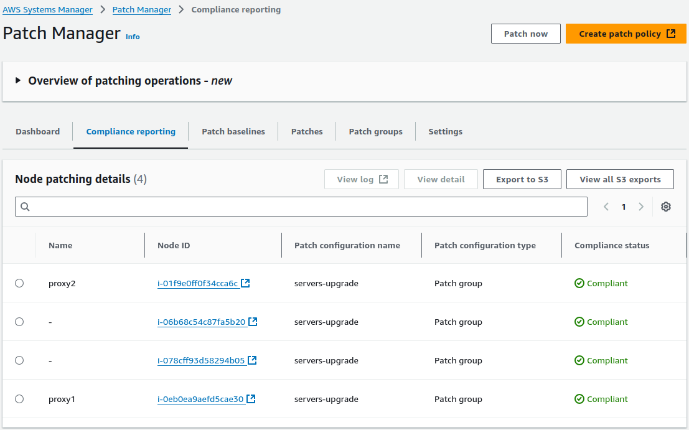

# Lab 3



## Make architecture same as screenshot (where two EC2 instances in public are working as reverse proxy to point to internal load balancer which forwards traffic to two private instances having Apache downloaded on it)
`2 EC2 instances in public subnets (Reverse Proxies) ---forward traffic---> internal ALB ---forwards traffic---> 2 EC2 instances in private subnets (Apache Backend Servers)`

### VPC
- VPC:
    - name = `task3-vpc`
    - cidr-block = `10.0.0.0/16`
- Public Subnet 1:
    - name = `task3-pb-subnet1`
    - cidr-block = `10.0.0.0/24`
    - availability-zone = `us-east-1a`
- Public Subnet 2:
    - name = `task3-pb-subnet2`
    - cidr-block = `10.0.2.0/24`
    - availability-zone = `us-east-1b`
- Private Subnet 1:
    - name = `task3-pv-subnet1`
    - cidr-block = `10.0.1.0/24`
    - availability-zone = `us-east-1a`
- Private Subnet 2:
    - name = `task3-pv-subnet2`
    - cidr-block = `10.0.3.0/24`
    - availability-zone = `us-east-1b`
- Internet Gateway:
    - name = `task3-igw`
    - Attach to VPC = `task3-vpc`
- NAT Gateway:
    - name = `task3-ngw`
    - subnet = `task3-pb-subnet1`
    - Allocate Elastic IP.
- Public Route Table:
    - name = `task3-pb-rtb`
    - Route:
        - cidr-block = `0.0.0.0/0`
        - internet-gateway = `task3-igw`
- Private Route Table:
    - name = `task3-pv-rtb`
    - Route:
        - cidr-block = `0.0.0.0/0`
        - nat-gateway = `task3-ngw`
- Associate the public subnet with the public route table and the private subnet with the private route table.

<p align="center">
  <strong>VPC Overview</strong>
  <br>
  
</p>

### External Layer
- Key Pair:
    - name = `my-rsa-key`
- External ALB Security Group:
    - name  = `external-app-lb-secgrp`
    - Inbound Rule:
        - type = `HTTP`
        - source = `0.0.0.0/0`
- Proxy Servers Security Group:
    - name = `proxy-secgrp`
    - Inbound Rule 1:
        - type = `SSH`
        - source-type = My IP
    - Inbound Rule 2:
        - type = `HTTP`
        - source = security-group: `external-app-lb-secgrp`
- Proxy Server 1:
    - name: `proxy1`
    - ami = `Amazon Linux`
    - instance-type = `t2.micro`
    - key-name = `my-rsa-key`
    - Auto-assign-public-IP = `true`
    - subnet = `task3-pb-subnet1`
    - secgrp = `proxy-secgrp`
    - User data:
        ```bash
        #!/bin/bash
        sudo yum update -y
        sudo yum install -y nginx
        sudo service nginx start
        echo "Hello From Proxy1 Instance!" | sudo tee /usr/share/nginx/html/index.html
        ```
- Proxy Server 2:
    - name: `proxy2`
    - ami = `Amazon Linux`
    - instance-type = `t2.micro`
    - key-name = `my-rsa-key`
    - Auto-assign-public-IP = `true`
    - subnet = `task3-pb-subnet2`
    - secgrp = `proxy-secgrp`
    - User data:
        ```bash
        #!/bin/bash
        sudo yum update -y
        sudo yum install -y nginx
        sudo service nginx start
        echo "Hello From Proxy2 Instance!" | sudo tee /usr/share/nginx/html/index.html
        ```
- External ALB Target Group:
    - type = `Instances`
    - name = `external-app-lb-trggrp`
    - protocol = `HTTP`
    - port = `80`
    - targets: `proxy1` and `proxy2`
- External ALB:
    - name = `External-ALB`
    - type = `application`
    - scheme = `Internet-facing`
    - AZ-and-subnets:
        - `us-east-1a`: `task3-pb-subnet1`
        - `us-east-1b`: `task3-pb-subnet2`
    - security-group = `external-app-lb-secgrp`
    - Listeners and routing:
        - listener-port = `80`
        - listener-protocol = `HTTP`
        - target-grp-name = `external-app-lb-trggrp`
        - target-grp-port = `80`       # port and
        - target-grp-protocol = `HTTP` # protocol used to communicate with the targets.

<p align="center">
  <strong>Accessing External ALB DNS</strong>
  <br>
  
</p>

### Internal Layer
- Internal ALB Security Group:
    - name  = `internal-app-lb-secgrp`
    - Inbound Rule:
        - type = `HTTP`
        - source = security-group: `proxy-secgrp`
- Backend Servers Security Group:
    - name = `backend-secgrp`
    - Inbound Rule:
        - type = `HTTP`
        - source = security-group: `internal-app-lb-secgrp`
- Backend Server 1:
    - name: `backend1`
    - ami = `Amazon Linux`
    - instance-type = `t2.micro`
    - key-name = `my-rsa-key`
    - Auto-assign-public-IP = `false`
    - subnet = `task3-pv-subnet1`
    - secgrp = `backend-secgrp`
    - User data:
        ```bash
        #!/bin/bash
        sudo yum update -y
        sudo yum install -y httpd
        sudo systemctl start httpd
        sudo systemctl enable httpd
        echo "Hello From Backend1 Instance!" | sudo tee /var/www/html/index.html
        sudo systemctl restart httpd
        ```
- Backend Server 2:
    - name: `backend2`
    - ami = `Amazon Linux`
    - instance-type = `t2.micro`
    - key-name = `my-rsa-key`
    - Auto-assign-public-IP = `false`
    - subnet = `task3-pv-subnet2`
    - secgrp = `backend-secgrp`
    - User data:
        ```bash
        #!/bin/bash
        sudo yum update -y
        sudo yum install -y httpd
        sudo systemctl start httpd
        sudo systemctl enable httpd
        echo "Hello From Backend2 Instance!" | sudo tee /var/www/html/index.html
        sudo systemctl restart httpd
        ```
- Internal ALB Target Group:
    - type = `Instances`
    - name = `internal-app-lb-trggrp`
    - protocol = `HTTP`
    - port = `80`
    - targets: `backend1` and `backend2`
- Internal ALB:
    - name = `Internal-ALB`
    - type = `application`
    - scheme = `Internal`
    - AZ-and-subnets:
        - `us-east-1a`: `task3-pv-subnet1`
        - `us-east-1b`: `task3-pv-subnet2`
    - security-group = `internal-app-lb-secgrp`
    - Listeners and routing:
        - listener-port = `80`
        - listener-protocol = `HTTP`
        - target-grp-name = `internal-app-lb-trggrp`
        - target-grp-port = `80`       # port and
        - target-grp-protocol = `HTTP` # protocol used to communicate with the targets.
### Connecting External and Internal Layers
AWS Management Console allowed us to:
- Connect the External ALB with the Proxy Servers.
- Connect the Internal ALB with the Backend Servers.
- Security Groups/Firewalls to allow the traffic from the External Layer to the Internal one. **But** how would the Proxy Servers send traffic to the Internal ALB ?

-> The solution is to configure the Proxy Servers to forward the traffic to the Internal ALB.

1. Copy the Internal ALB DNS from AWS.
2. SSH into each Proxy Server, and execute the following commands:
```bash
sudo tee /etc/nginx/conf.d/proxy.conf > /dev/null <<EOT
server {
    listen 80;

    location / {
        proxy_pass http://<INTERNAL-ALB-DNS>;
    }
}
EOT
sudo service nginx restart
```
***Note:*** Change `<INTERNAL-ALB-DNS>` with the copied DNS.

<p align="center">
  <strong>Accessing External ALB DNS</strong>
  <br>
  
</p>

---

## Make Auto-scaling group and scale out based on any policy and prove it's working 
***Note:*** Terminate the Backend Servers before creating the ASG.
### Launch Template
- name = `task3-launch-temp`
- ami = `Amazon Linux`
- instance-type = `t2.micro`
- key-name = `my-rsa-key`
- subnet = `Don't include in launch template`
- secgrp = `backend-secgrp`
- User data:
    ```bash
    #!/bin/bash
    sudo yum update -y
    sudo yum install -y httpd
    sudo systemctl start httpd
    sudo systemctl enable httpd
    echo "Hello From Backend $(hostname -i) Instance!" | sudo tee /var/www/html/index.html
    sudo systemctl restart httpd
    ```
### ASG
- name = `task3-asg`
- launch-template = `task3-launch-temp`
- AZ-and-subnets:
    - `us-east-1a`: `task3-pv-subnet1`
    - `us-east-1b`: `task3-pv-subnet2`
- load-balancing = `Attach to an existing load balancer`
- target-groups = `internal-app-lb-trggrp`
- Group Size:
    - Min = `2`
    - Desired = `2`
    - Max = `3`
- Automatic scaling:
    - policy = `Target tracking scaling policy`
    - name = `task3-asg-policy`
    - metric-type = `Average CPU utilization`
    - target-value = `50`

<p align="center">
  <strong>New Instances Created Automatically</strong>
  <br>
  
</p>

<p align="center">
  <strong>Accessing External ALB DNS after using ASG</strong>
  <br>
  
</p>

---

## Make patch upgrade to all servers in task 1 through system manager
1. Access the AWS Systems Manager service.
2. Choose Patch Manager from Node tools at the left side of the screen.
3. Create a patch policy:
    - Patch policy name: `servers-upgrade`
    - Patch operation: `Scan and install`
    - Reboot if needed: `true`
    - Write output to S3 bucket: `false`
    - Target Nodes: `All managed nodes`
    - Add required IAM policies to existing instance profiles attached to your instances: `true`

<p align="center">
  <strong>Navigate to Compliance reporting and wait until you see the servers created in task 1</strong>
  <br>
  
</p>

4. Press on `Patch now`, then `Scan and install`.

<p align="center">
  <strong>A few minutes later, we can see the success of the operation</strong>
  <br>
  
</p>

<p align="center">
  <strong>Navigate to Compliance reporting once again and you should see all nodes are updated</strong>
  <br>
  
</p>

---
