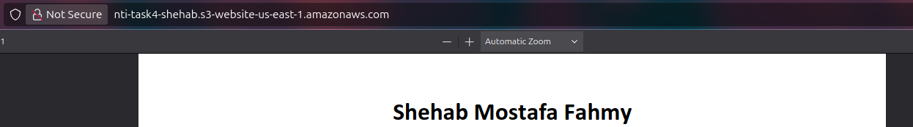
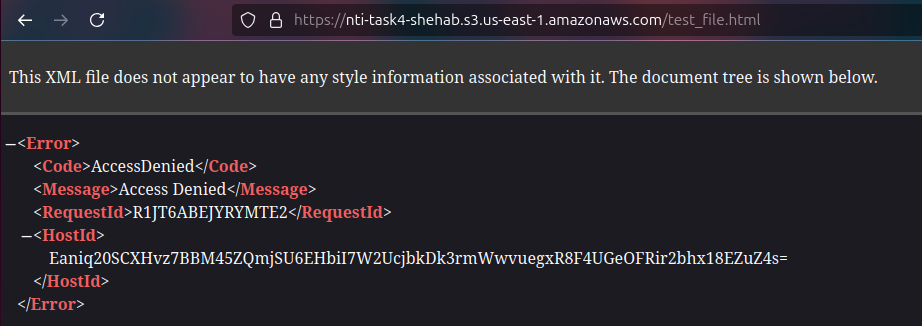
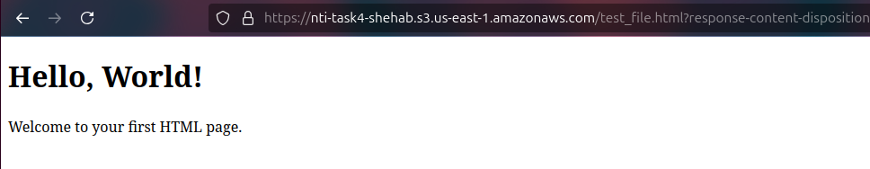
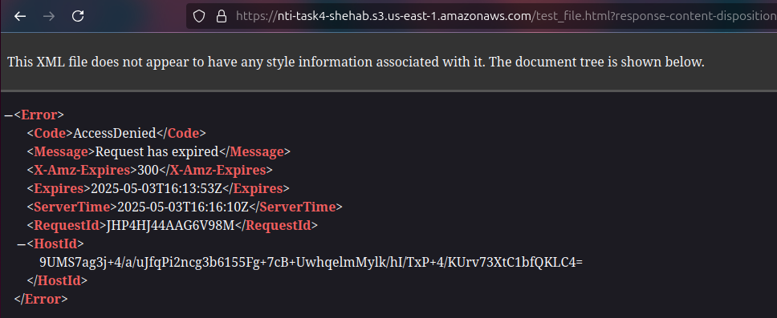
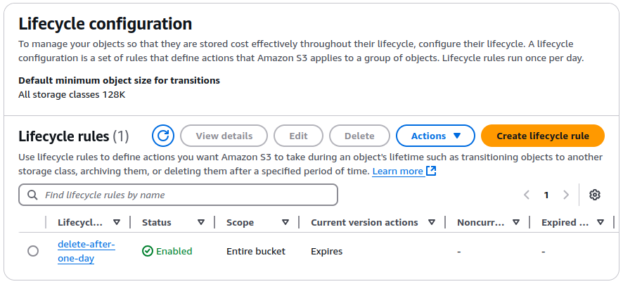
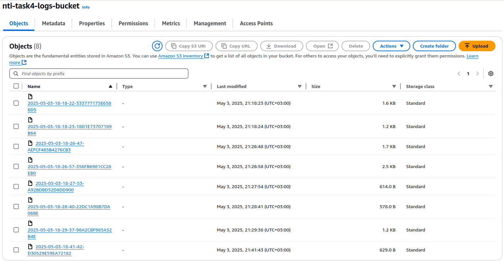
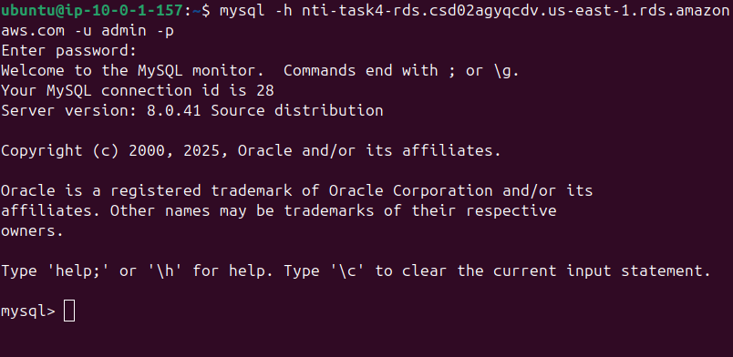

# Lab4

## Make your CV as a static website on S3
1. Create an S3 bucket:
    - type: `General purpose`
    - name: `nti-task4-shehab`
    - Block all public access: false
2. Upload the CV file.
3. Bucket properties > Static website hosting > Edit:
    - Static website hosting: `Enable`
    - Index document: `Shehab_Fahmy_DevOps_CV.pdf` or convert it to an HTML file.
4. Bucket permissions > Object Ownership > Edit > ACLs enabled
5. Select all objects > Actions > Make public using ACL > Make public

<p align="center">
  <strong>Access the bucket from the bucket website endpoint at properties</strong>
  <br>
  
</p>

---

## Make pre-signed URL for 5 min then prove it’s not working after 5 min
1. Upload a file.
2. Try to access this file using the object URL.
<p align="center">
  
</p>
3. Select the object > Actions > Share with a presigned URL > 5 Minutes
4. Try to access the presigned URL.
<p align="center">
  
</p>
5. Try to access the presigned URL after 5 minutes.
<p align="center">
  
</p>

---

## Make S3 lifecycle policy to delete any file existed more than 1 day
1. Bucket management > Create lifecycle rule:
    - name: `delete-after-one-day`
    - rule scope: `Apply to all objects in the bucket`
    - Lifecycle rule actions: `Expire current versions of objects`
    - Days: `1`
<p align="center">
  
</p>

---

## Transfer data from your bucket to another bucket in another account
Suppose we want to send an object from Shehab's bucket to Fady's bucket.
1. Create a new bucket policy for Fady's bucket:
```
{
  "Version": "2012-10-17",
  "Statement": [
    {
      "Sid": "AllowShehabToPutObjects",
      "Effect": "Allow",
      "Principal": {
        "AWS": "arn:aws:iam::<SHEHAB_ID>:root"
      },
      "Action": "s3:PutObject",
      "Resource": "arn:aws:s3:::fady-bucket-name/*"
    }
  ]
}
```

---

## Enable access logs in the bucket to another bucket
1. Create a new bucket for storing logs (target).
2. Create a bucket policy for the target to allow the logging service to add logs into the target bucket:
```
{
  "Version": "2012-10-17",
  "Statement": [
    {
      "Sid": "S3ServerAccessLogsPolicy",
      "Effect": "Allow",
      "Principal": {
        "Service": "logging.s3.amazonaws.com"
      },
      "Action": "s3:PutObject",
      "Resource": "arn:aws:s3:::nti-task4-logs-bucket/*",
      "Condition": {
        "StringEquals": {
          "aws:SourceAccount": "ACCOUNT_ID"
        }
      }
    }
  ]
}
```
3. Source bucket properties > Server access logging:
    - Server access logging: `Enable`
    - Destination: `s3://nti-task4-logs-bucket`

<p align="center">
  <strong>After few minutes, check the logs bucket</strong>
  <br>
  
</p>

---

## Make RDS of MySQL and connect to it through EC2 in same VPC
1. Create a VPC:
    - name: `nti-task4-vpc`
    - IPv4 CIDR: `10.0.0.0/16`
2. Create 3 private subnets:
    - name: `public-subnet`, `private-subnet-1`, and `private-subnet-2`
    - AZ: `us-east-1a`, `us-east-1b`, and `us-east-1c`
    - IPv4 subnet CIDR block: `10.0.1.0/24`, `10.0.2.0/24`, and `10.0.3.0/24`
3. Create an Internet Gateway then attach to it to the VPC:
    - name: `nti-task4-igw`
4. Create Route Tables then assign them to the subnets:
    - name: `public-rt` and `public-rt`
    - Add a new route to the public Route Table
        - Destination: `0.0.0.0/0`
        - Target: Internet Gateway(`nti-task4-igw`)
5. Create a public EC2 with a Security Group `nti-task4-ec2-secgrp` that allows SSH from your IP address.
6. Navigate to Aurora and RDS then Create a Subnet Group:
    - name: `nti-task4-rds-subgrp`
    - AZ: `us-east-1b` and `us-east-1c`
    - Subnets: `private-subnet-1` and `private-subnet-2`
7. Create Database:
    - Engine type: `MySQL`
    - Templates: `Free tier`
    - DB instance identifier: `nti-task4-rds`
    - Create a strong password
    - DB instance class: `db.t3.micro`
    - VPC: `nti-task4-vpc`
    - DB subnet group: `nti-task4-rds-subgrp`
    - Public access: `No`
    - VPC security group: `Create new`:
        - name: `nti-task4-rds-secgrp`
        - Add Inbound Rule:
            - Source: Security Group(`nti-task4-ec2-secgrp`)
8. SSH into the EC2 instance:
```bash
sudo yum install -y mysql
# or sudo apt update && sudo apt install -y mysql-client
mysql -h <RDS-endpoint> -u admin -p
```

<p align="center">
  
</p>

---
