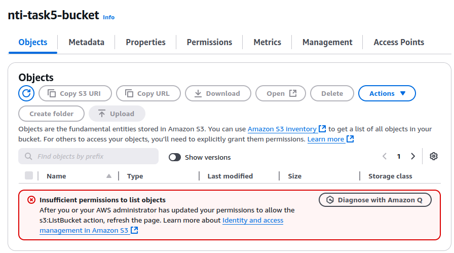
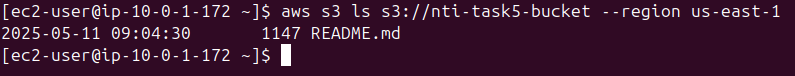
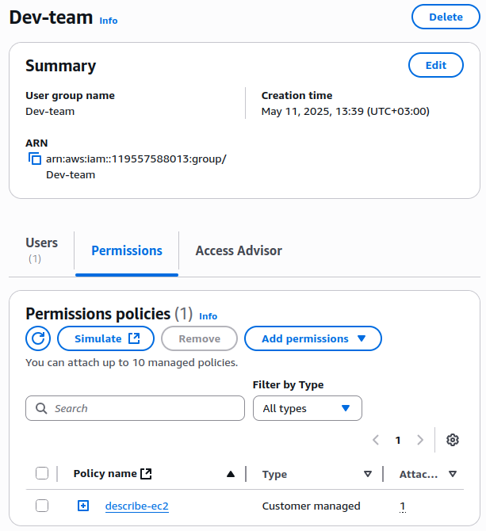
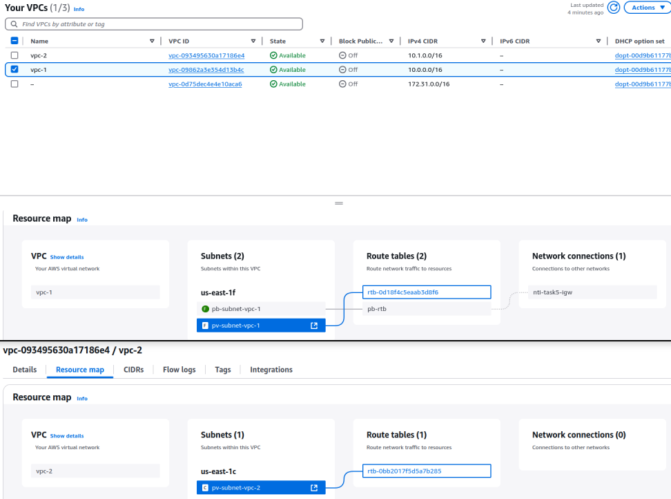
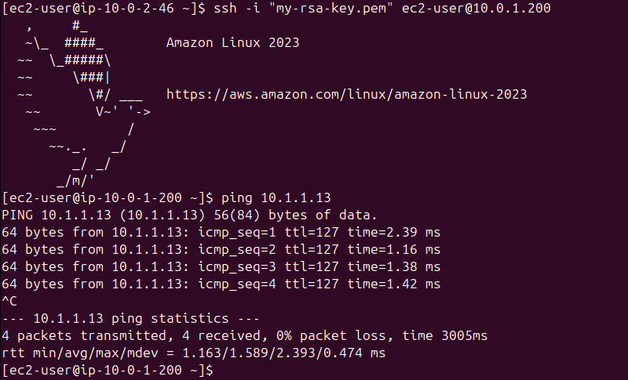
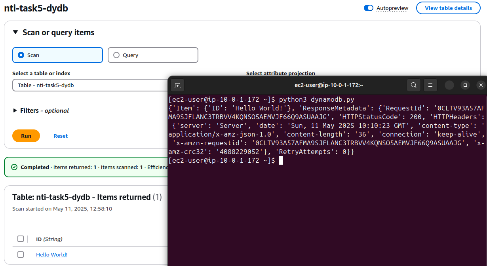

# Lab 5:

## Create an S3 bucket policy to restrict access to its objects only if the request comes from a specific VPC through an endpoint.
1. Create the VPC `nti-task5-vpc`.
2. Create the private Subnet `nti-task5-pv-subnet`.
3. Create the Route Table `nti-task5-pv-rtb` and attach it to the private Subnet.
4. Create the VPC Endpoint: VPC > Endpoints > Create endpoint:
    - name: `nti-task5-vpce`
    - type: `AWS services`
    - services: `com.amazonaws.us-east-1.s3` (Gateway)
    - vpc: `nti-task5-vpc`
    - policy: `Full Access`
5. Modify the Endpoint to add the Route Table: Actions > Manage route tables > `nti-task5-pv-rtb`.
6. Create the S3 bucket `nti-task5-bucket`.
7. Add the bucket policy to allow traffic through the VPC Endpoint only:
    ```json
    {
      "Version": "2012-10-17",
      "Statement": [
        {
          "Sid": "AllowAccessOnlyFromVPCEndpoint",
          "Effect": "Deny",
          "Principal": "*",
          "Action": "s3:*",
          "Resource": [
            "arn:aws:s3:::nti-task5-bucket",
            "arn:aws:s3:::nti-task5-bucket/*"
          ],
          "Condition": {
            "StringNotEquals": {
              "aws:SourceVpce": "vpce-033d6f76e236e2bcf"
            }
          }
        },
        {
          "Sid": "AllowAllFromVPC",
          "Effect": "Allow",
          "Principal": "*",
          "Action": "s3:*",
          "Resource": [
            "arn:aws:s3:::nti-task5-bucket",
            "arn:aws:s3:::nti-task5-bucket/*"
          ]
        }
      ]
    }
    ```

<p align="center">
  <strong>Once the bucket policy is applied, we can no longer have access to the S3 from the Console</strong>
  <br>
  
</p>

<p align="center">
  <strong>Accessing the bucket from an EC2 with the required IAM Role</strong>
  <br>
  
</p>

---

## Create a policy to allow the Dev team to describe EC2 instances only if their IP is within a specific range.
1. Create a new user `developer01`.
2. Create `Dev-team` user group if it doesn't exist, then add the developer to it.
3. Create the IAM Policy `describe-ec2`, then attach it to the user group `Dev-team`:
    ```json
    {
      "Version": "2012-10-17",
      "Statement": [
        {
          "Effect": "Allow",
          "Action": "ec2:DescribeInstances",
          "Resource": "*",
          "Condition": {
            "IpAddress": {
              "aws:SourceIp": "41.xxx.xxx.0/24"
            }
          }
        }
      ]
    }
    ```

<p align="center">
  
</p>

---

## Create a policy to allow stopping or starting instances only during working hours.
```json
{
  "Version": "2012-10-17",
  "Statement": [
    {
      "Effect": "Allow",
      "Action": [
        "ec2:StartInstances",
        "ec2:StopInstances"
      ],
      "Resource": "*",
      "Condition": {
        "DateGreaterThan": {
          "aws:CurrentTime": "2025-01-01T09:00:00Z"
        },
        "DateLessThan": {
          "aws:CurrentTime": "2025-01-01T17:00:00Z"
        }
      }
    }
  ]
}
```

---

## Create VPC peering and prove that two different private EC2 instances in each VPC can communicate.
1. Create 2 VPCs that have:
    - private Subnet:
    - private Route Table
    - private EC2 instance
2. Create a VPC peering connection: VPC > Peering connections > Create peering connection:
    - name: `nti-task5-pc`
    - VPC ID (Requester): `vpc-1`
    - VPC ID (Accepter): `vpc-2`
    - Actions > Accept request
3. Update Route Tables:
    - VPC 1 route: VPC 2 CIDR (`10.1.0.0/16`) - peering connection(`nti-task5-pc`)
    - VPC 2 route: VPC 1 CIDR (`10.0.0.0/16`) - peering connection(`nti-task5-pc`)
4. Modify the Security Groups to allow all traffic between each other.

<p align="center">
  <strong>Final view of VPCs</strong>
  <br>
  
</p>

<p align="center">
  <strong>Pinging 2nd EC2 from the 1st EC2 through a public EC2 (Bastion Host)</strong>
  <br>
  
</p>

---

## (BONUS) Create a PrivateLink to allow an EC2 in one VPC to reach an EC2 in a different VPC.

## Create a DynamoDB table and connect to it through a gateway endpoint.
1. Create the VPC `nti-task5-vpc`.
2. Create the private Subnet `nti-task5-pv-subnet`.
3. Create the Route Table `nti-task5-pv-rtb` and attach it to the private Subnet.
4. Create the VPC Endpoint: VPC > Endpoints > Create endpoint:
    - name: `nti-task5-vpce`
    - type: `AWS services`
    - services: `com.amazonaws.us-east-1.dynamodb` (Gateway)
    - vpc: `nti-task5-vpc`
    - policy: `Full Access`
5. Modify the Endpoint to add the Route Table: Actions > Manage route tables > `nti-task5-pv-rtb`.
6. Create the DynamoDB:
    - name: `nti-task5-dydb`
    - Partition key: `ID` (`String`)
    - Permissions > Resource-based policy for table > Create table policy:
        ```json
        {
          "Version": "2012-10-17",
          "Statement": [
            {
              "Effect": "Allow",
              "Action": "dynamodb:*",
              "Resource": "arn:aws:dynamodb:us-east-1:119557588013:table/nti-task5-dydb",
              "Principal": "*",
              "Condition": {
                "StringEquals": {
                  "aws:SourceVpce": "vpce-0442e13381398146c"
                }
              }
            },
            {
              "Effect": "Deny",
              "Action": "dynamodb:*",
              "Resource": "arn:aws:dynamodb:us-east-1:119557588013:table/nti-task5-dydb",
              "Principal": "*",
              "Condition": {
                "StringNotEquals": {
                  "aws:SourceVpce": "vpce-0442e13381398146c"
                }
              }
            }
          ]
        }
        ```
7. Add the required IAM Role to the EC2 instance for accessing the table.
8. Execute the following script on the EC2 instance:
```py
import boto3
dynamodb = boto3.resource('dynamodb', region_name='us-east-1')
table = dynamodb.Table('nti-task5-dydb')
response = table.get_item(Key={'ID': 'Hello World!'})
print(response)
```

<p align="center">
  
</p>

---
