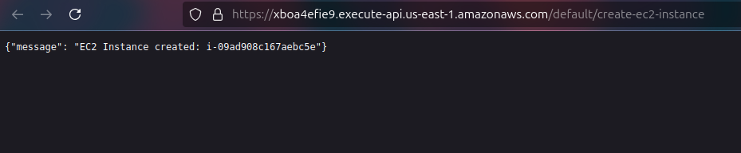
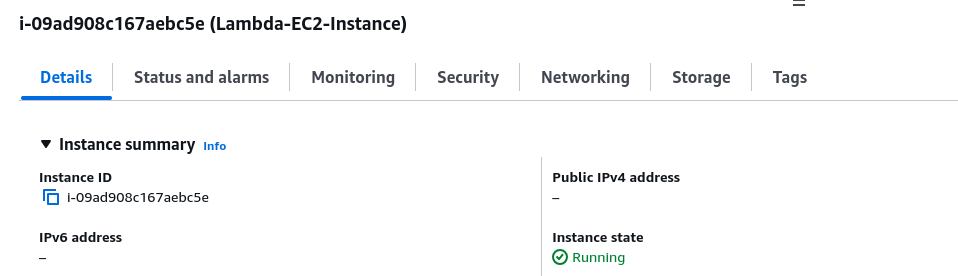
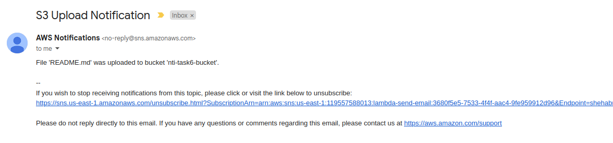
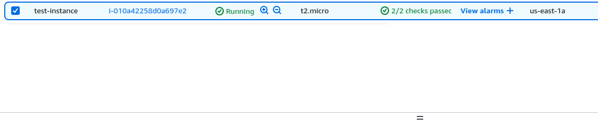
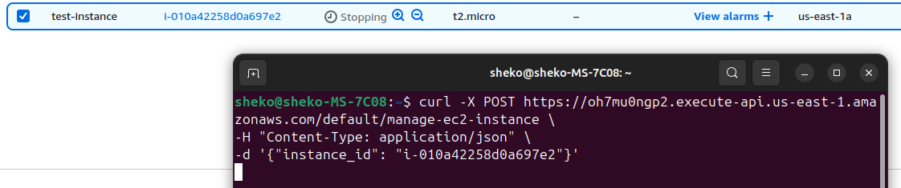
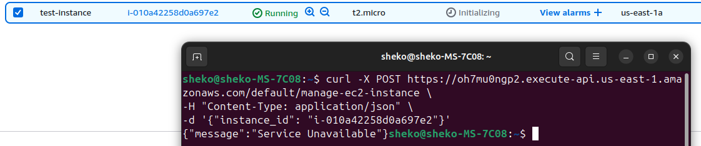
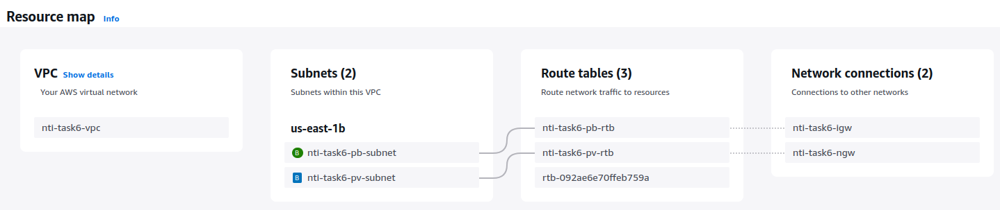
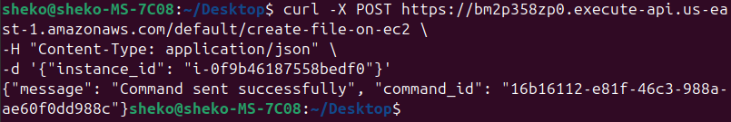
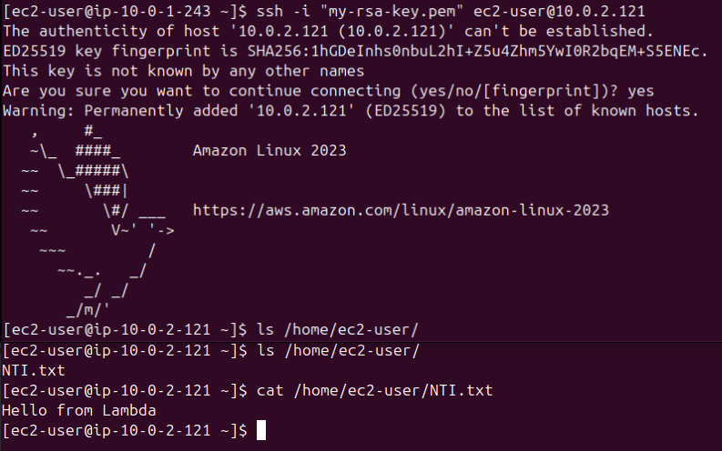
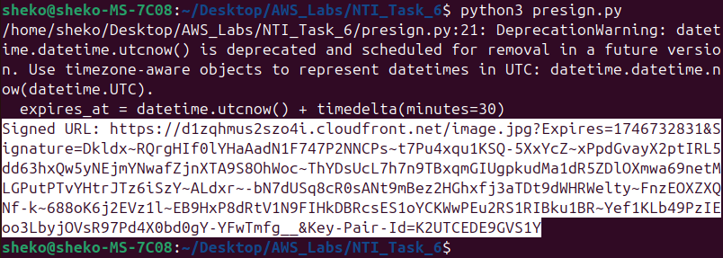

# Lab 6

## Create a Lambda function that automates the creation of an EC2
1. Create a function:
    - name: `create-ec2-instance`
    - Runtime: `Python 3.13`
    - Lambda Configuration > Permissions > Execution role > Edit > timeout: `30 seconds`
2. Create an IAM role for the Lambda function to run instances on your behalf:
    - Trusted entity type: `AWS Service`
    - Use case: `Lambda`
    - Add permissions: `AmazonEC2FullAccess` # NOT RECOMMENDED
    - name: `lambda-create-ec2-role`
3. Attach the IAM role to the Lambda function: Lambda Configuration > Permissions > Execution role > Edit > Existing role: `lambda-create-ec2-role`
4. Create VPC, Subnet, and Security Group for the EC2 to be created.
5. Add code to make the destination logic:
```py
import boto3
import json

def lambda_handler(event, context):
    ec2 = boto3.client('ec2', region_name='us-east-1')

    try:
        response = ec2.run_instances(
            ImageId='ami-0f88e80871fd81e91',
            InstanceType='t2.micro',
            MinCount=1,
            MaxCount=1,
            SecurityGroupIds=['sg-0c8a26edcd2c69f28'],
            SubnetId='subnet-009668560d246de60',
            TagSpecifications=[
                {
                    'ResourceType': 'instance',
                    'Tags': [
                        {'Key': 'Name', 'Value': 'Lambda-EC2-Instance'}
                    ]
                }
            ]
        )

        instance_id = response['Instances'][0]['InstanceId']
        return {
            'statusCode': 200,
            'body': json.dumps({'message': f'EC2 Instance created: {instance_id}'})
        }

    except Exception as e:
        return {
            'statusCode': 500,
            'body': json.dumps({'error': str(e)})
        }
```
6. Add an `API Gateway` trigger:
    - Create a new API
    - type: `HTTP API`
    - Security: `Open`

<p align="center">
  <strong>Access the API Gateway Endpoint</strong>
  <br>
  
</p>

<p align="center">
  
</p>

---

## Create a Lambda function to send an email in case any file is uploaded to a specific S3 bucket
1. Create an S3 bucket:
    - name: `nti-task6-bucket`
2. Create a function:
    - name: `bucket-listener`
    - runtime: `Python 3.13`
    - Lambda Configuration > Permissions > Execution role > Edit > timeout: `30 seconds`
3. Create an SNS topic:
    - name: `lambda-send-email`
    - Create a subscription:
        - protocol: `Email`
        - endpoint: `test@example.com`
4. Confirm the subscription through your email inbox.
5. Create an IAM role for the Lambda function to read S3 and send notifications:
    - Trusted entity type: `AWS Service`
    - Use case: `Lambda`
    - Add permissions: `AmazonSNSFullAccess` and `AmazonS3ReadOnlyAccess`
    - name: `lambda-send-email`
6. Attach the IAM role to the Lambda function: Lambda Configuration > Permissions > Execution role > Edit > Existing role: `lambda-send-email`
7. Add code to make the destination logic:
***Note:*** Replace the SNS arn.
```py
import json
import boto3
import urllib.parse

sns = boto3.client('sns')

SNS_TOPIC_ARN = "arn:aws:sns:REGION:ACCOUNT_ID:S3UploadNotifications"  # Replace

def lambda_handler(event, context):
    # Extract object details from S3 event
    bucket = event['Records'][0]['s3']['bucket']['name']
    key = urllib.parse.unquote_plus(event['Records'][0]['s3']['object']['key'])

    message = f"File '{key}' was uploaded to bucket '{bucket}'."

    # Publish message to SNS
    response = sns.publish(
        TopicArn=SNS_TOPIC_ARN,
        Subject="S3 Upload Notification",
        Message=message
    )

    return {
        'statusCode': 200,
        'body': json.dumps('Notification sent!')
    }
```
8. Configure the bucket to trigger the function:
    - Bucket Properties > Event notifications > Create event notification:
        - name: `trigger-lambda`
        - event types: Object creation(`Put`)
        - destination: `Lambda function` (`bucket-listener`)

<p align="center">
  <strong>Uploading a file to the S3 bucket</strong>
  <br>
  
</p>

---

## Create a Lambda function to stop a specific EC2 for 5 min then start it again
1. Create a function:
    - name: `manage-ec2-instance`
    - Runtime: `Python 3.13`
    - Lambda Configuration > Permissions > Execution role > Edit > timeout: `6 minutes`
2. Create an IAM role for the Lambda function to manage instances on your behalf:
    - Trusted entity type: `AWS Service`
    - Use case: `Lambda`
    - Add permissions: `AmazonEC2FullAccess`
    - name: `lambda-manage-ec2-role`
3. Attach the IAM role to the Lambda function: Lambda Configuration > Permissions > Execution role > Edit > Existing role: `lambda-manage-ec2-role`
4. Create VPC, Subnet, and Security Group for the EC2 to be created.
5. Add code to make the destination logic:
```py
import boto3
import time
import json

ec2 = boto3.client('ec2')

def lambda_handler(event, context):
    # Parse instance ID from the API Gateway JSON body
    try:
        body = json.loads(event['body'])
        instance_id = body['instance_id']
    except (KeyError, json.JSONDecodeError):
        return {
            'statusCode': 400,
            'body': json.dumps({'error': 'Invalid input. Expected JSON with instance_id.'})
        }

    try:
        # Stop the EC2 instance
        ec2.stop_instances(InstanceIds=[instance_id])
        waiter = ec2.get_waiter('instance_stopped')
        waiter.wait(InstanceIds=[instance_id])

        # Wait for 5 minutes
        time.sleep(300)

        # Start the EC2 instance
        ec2.start_instances(InstanceIds=[instance_id])
        waiter = ec2.get_waiter('instance_running')
        waiter.wait(InstanceIds=[instance_id])

        return {
            'statusCode': 200,
            'body': json.dumps({'message': f'Instance {instance_id} stopped and started successfully'})
        }

    except Exception as e:
        return {
            'statusCode': 500,
            'body': json.dumps({'error': str(e)})
        }
```
6. Add an `API Gateway` trigger:
    - create a new API
    - type: `HTTP API`
    - security: `Open`
    - Create a new route:
        - POST: /ec2/restart

7. From your terminal, execute the following command:
***Note:*** Change the API Gateway endpoint and the required instance ID.
```bash
curl -X POST https://oh7mu0ngp2.execute-api.us-east-1.amazonaws.com/default/manage-ec2-instance \
-H "Content-Type: application/json" \
-d '{"instance_id": "i-010a42258d0a697e2"}'
```

<p align="center">
  <strong>Running Instance</strong>
  <br>
  
</p>

<p align="center">
  <strong>Executing POST request</strong>
  <br>
  
</p>

<p align="center">
  <strong>After the specified minutes</strong>
  <br>
  
</p>

---

## Create a Lambda function that access private server and create a file called NTI.txt
1. Create VPC, Subnet, Route Table, Internet Gateway, and Security Groups for the public and private instances.
2. Launch the Amazon Linux EC2 instance.
3. Create a NAT Gateway for the private instance and allow outbound HTTPS in the private security group.

<p align="center">
  
</p>

4. Create a new IAM role `ssm-manage-ec2`:
    - type: `AWS service`
    - service: `EC2`
    - permissions: `AmazonSSMManagedInstanceCore`
5. EC2 Instance Actions > Security > Modify IAM role > `ssm-manage-ec2`.
6. Create an IAM Role for Lambda `lambda-for-ssm`:
    - type: `AWS service`
    - service: `Lambda`
    - permissions: `AWSLambdaBasicExecutionRole` and `AmazonSSMFullAccess`
7. Create the Lambda Function `create-file-on-ec2`:
    - runtime: `Python 3.13`
    - execution-role > use an existing role > `lambda-for-ssm`
8. Add Lambda Code:
```py
import json
import boto3

def lambda_handler(event, context):
    # Parse the instance ID from the API Gateway POST body
    try:
        body = json.loads(event['body'])
        instance_id = body['instance_id']
    except (KeyError, json.JSONDecodeError):
        return {
            'statusCode': 400,
            'body': json.dumps({'error': 'Missing or invalid instance_id in request body'})
        }

    # Create SSM client
    ssm = boto3.client('ssm')

    # Command to create the NTI.txt file
    command = 'echo "Hello from Lambda" > /home/ec2-user/NTI.txt'

    try:
        response = ssm.send_command(
            InstanceIds=[instance_id],
            DocumentName="AWS-RunShellScript",
            Parameters={'commands': [command]},
        )
        return {
            'statusCode': 200,
            'body': json.dumps({'message': 'Command sent successfully', 'command_id': response['Command']['CommandId']})
        }

    except Exception as e:
        return {
            'statusCode': 500,
            'body': json.dumps({'error': str(e)})
        }
```
9. Create an API Gateway as a trigger with POST route as we did before.
10. From your terminal, execute the following command:
***Note:*** Change the API Gateway endpoint and the required instance ID.
```bash
curl -X POST https://bm2p358zp0.execute-api.us-east-1.amazonaws.com/default/create-file-on-ec2 \
-H "Content-Type: application/json" \
-d '{"instance_id": "i-0f9b46187558bedf0"}'
```

<p align="center">
  <strong>Response of the POST request</strong>
  <br>
  
</p>

<p align="center">
  <strong>Checking the private instance after sending the POST request</strong>
  <br>
  
</p>

---

## Create CloudFront to cache some images in an S3 bucket then generate CloudFront presigned URL to expose this image as URL
1. Create a private S3 bucket `nti-task6-bucket` and upload the image.
2. Create a CloudFront Origin access control settings:
    - name: `nti-task6-oac`
    - origin: `S3`
3. Create a CloudFront Distribution:
    - origin-domain: `nti-task6-bucket.s3.us-east-1.amazonaws.com`
    - Origin access > `Origin access control settings` > `nti-task6-oac`
    - Default cache behavior > Viewer protocol policy > `Redirect HTTP to HTTPS`
    - Web Application Firewall > `Do not enable security protections`
4. Copy the S3 policy generated after Distribution creation and update the bucket policy.
```
{
        "Version": "2008-10-17",
        "Id": "PolicyForCloudFrontPrivateContent",
        "Statement": [
            {
                "Sid": "AllowCloudFrontServicePrincipal",
                "Effect": "Allow",
                "Principal": {
                    "Service": "cloudfront.amazonaws.com"
                },
                "Action": "s3:GetObject",
                "Resource": "arn:aws:s3:::nti-task6-bucket/*",
                "Condition": {
                    "StringEquals": {
                      "AWS:SourceArn": "arn:aws:cloudfront::119557588013:distribution/E2DXQD9V1O1HLP"
                    }
                }
            }
        ]
      }
```
5. Create CloudFront key pair:
    - Profile > Security credentials > CloudFront key pairs > Create CloudFront key pair > Download the keys
6. Upload the `public_key.pem` to AWS:
    - CloudFront > Public keys > Create public key:
        - name: `my-key`
        - key: `public_key.pem` contents
7. Create a key group:
    - CloudFront > Key groups > Create key group:
        - name: `my-key-group`
        - public-keys: `my-key`
8. Update the CloudFront distribution:
    - distribution > Behaviors tab > Edit default behavior:
        - Restrict viewer access > `Yes` > `my-key-group`
9. On your local machine use a Python script to sign the URL using the private key:
```py
import boto3
import rsa
from datetime import datetime, timedelta
from botocore.signers import CloudFrontSigner

# Replace with your CloudFront key pair ID and private key path
key_id = "PUBLIC_KEY_ID"
private_key_path = "private_key.pem"
cloudfront_url = "https://<Distribution_domain_name>/image.jpg"

# Read the private key
def rsa_signer(message):
    with open(private_key_path, 'rb') as f:
        private_key = rsa.PrivateKey.load_pkcs1(f.read())
    return rsa.sign(message, private_key, 'SHA-1')

# CloudFront signer setup
signer = CloudFrontSigner(key_id, rsa_signer)

# Set the expiration time for the signed URL
expires_at = datetime.utcnow() + timedelta(minutes=30)

# Generate the signed URL
signed_url = signer.generate_presigned_url(cloudfront_url, date_less_than=expires_at)

print("Signed URL:", signed_url)
```

<p align="center">
  <strong>Executing the Python script</strong>
  <br>
  
</p>

<p align="center">
  <strong>Accessing the signed URL</strong>
  <br>
  
</p>

---
