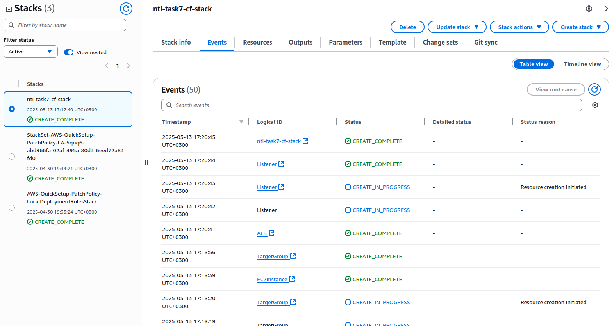
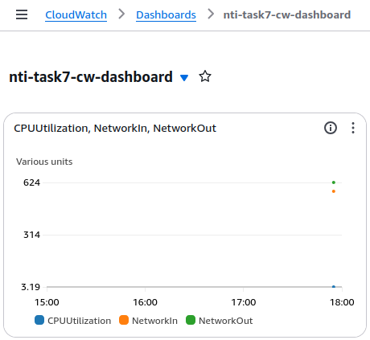
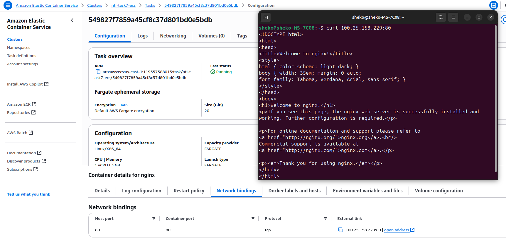

# Lab 7

## Create CloudFormation stack to create ALB pointing to server has Nginx installed (all steps through stack, no manual steps)
- Create a stack:
    - Choose an existing template: Upload a [template file](CloudFormation_Template.yaml)
    - name: `nti-task7-cf-stack`

  <strong>Stack Events</strong>
   
  

---

## Create CloudWatch dashboard to monitor EC2
1. Create an EC2 instance.
2. CloudWatch > Dashboards > Create dashboard:
    - name: `nti-task7-cw-dashboard`
    - widget: `Line` or `Number` or `Stacked area`
    - Browse > Metrics > EC2 > `nti-task7-ec2` > Per-Instance Metrics: `CPUUtilization`

  

---

## Create CloudWatch alarm to make Autoscaling action based on any alarm
1. Create a Launch template:
    - name: `nti-task7-lt`
2. Create an Auto Scaling group: EC2 > Auto Scaling Groups:
    - name: `nti-task7-asg`
    - launch template: `nti-task7-lt`
3. CloudWatch > Alarms > All alarms > Create alarm:
    - metric > `nti-task7-ec2`: `CPUUtilization`
    - statistic: `Average`
    - period: `5 minutes`
    - condition: `Greater than 70`
    - Add Auto Scaling action
    - name: `nti-task7-alarm`
    
---

## Install CloudWatch agent on EC2 and show any custom metrics

---

## Create ECS task and run any Docker container exposed to internet
1. ECS > Clusters > Create cluster:
    - name: `nti-task7-ecs`
    - infrastructure: `Fargate`
2. Create Task definition:
    - Task definition family name: `nginx-task`
    - launch type: `Fargate`
    - Container-1:
        - name: `nginx`
        - Image URI: `nginx:latest`
3. Create a Security Group:
    - name: `ecs-secgrp`
    - Inbound rule:
        - type: `HTTP`
        - port: `80`
        - source: `0.0.0.0/0`
4. Run a new Task: ECS > Clusters > `nti-task7-ecs` > Tasks > Run new task:
    - Task definition family: `nginx-task`
    - Choose the VPC, Subnets, and the Security Group `ecs-secgrp`
   

  <strong>Accessing the container</strong>
   
  

   
---
